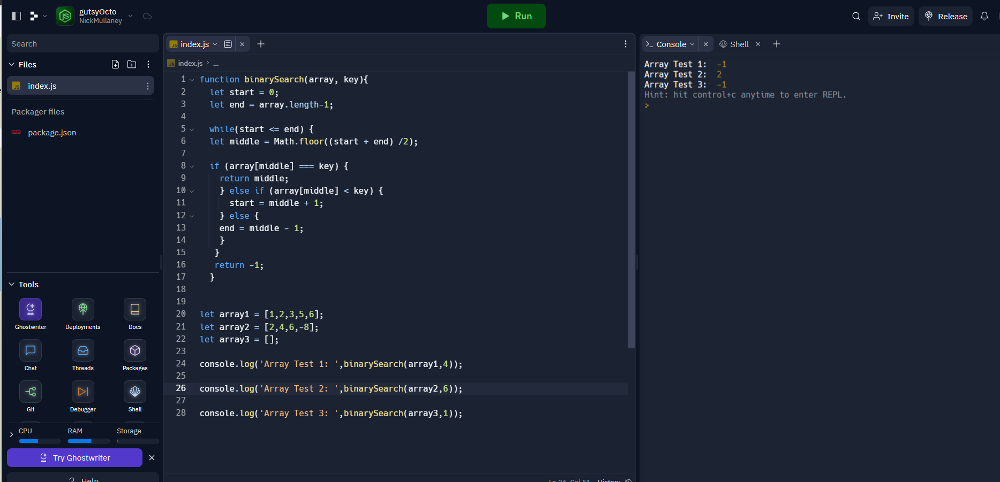

# binary-search
Write a function called `BinarySearch` which takes in 2 parameters: a sorted array and the search key. Without utilizing any of the built-in methods available to your language, return the index of the array’s element that is equal to the value of the search key, or -1 if the element is not in the array.

## Whiteboard Process

## Approach & Efficiency
I took the approach of finding the middle of the array and using that to determine if the value more towards the beginning or the end of the array. Then it narrows it down and continues searching that until it finds the value. If it doesn't then it will return -1
<!-- What approach did you take? Why? What is the Big O space/time for this approach? -->

## Solution
<!-- Show how to run your code, and examples of it in action -->

## Collaboration

Thanks to ChatGPT for the assist