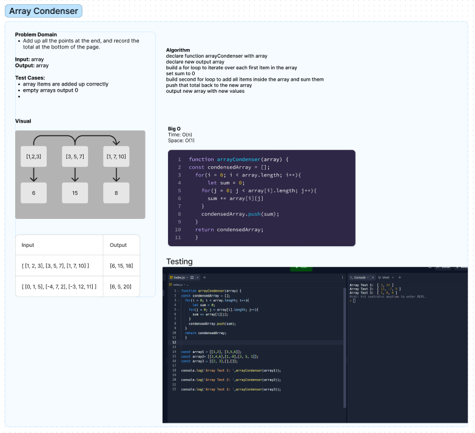

# array-condenser
Add up all the points at the end, and record the total at the bottom of the page.

Example
Input	                                       Output
[ [1, 2, 3], [3, 5, 7], [1, 7, 10] ]	      [6, 15, 18]
[ [0, 1, 5], [-4, 7, 2], [-3, 12, 11] ]	    [6, 5, 20]

## Whiteboard Process

## Approach & Efficiency
I knew that I would be using a double for loop because we needed to combine the array inside of the array. I then went about setting a sum baseline and on the second loop added each variable into the sum variable. Then pushed it to a new array and returned it
<!-- What approach did you take? Why? What is the Big O space/time for this approach? -->

## Solution
<!-- Show how to run your code, and examples of it in action -->

## Collaboration

Thanks to ChatGPT for the assist

## reflection

Doing these different practices is actually really helpful in terms of thinking about how to go about handling and tackling these different problems. Every time we are forced to think about how we would solve it before we begin coding it can really help out. It's really tempting to just start coding the problem and going through trial and error to find the answer. This does really help out with at least organizing all of the components that need to be incorporated in.I feel like while I'm going through and doing the sample code oftentimes I'm going back and adding a thing or two to the algorithm.I really think that I need to work on decisively thinking through the algorithm before just jumping in.This problem took me around 45 minutes to complete.I need to get better at asking or thinking about questions to ask interviewers when it comes to whiteboard problems so that's something to continue practicing