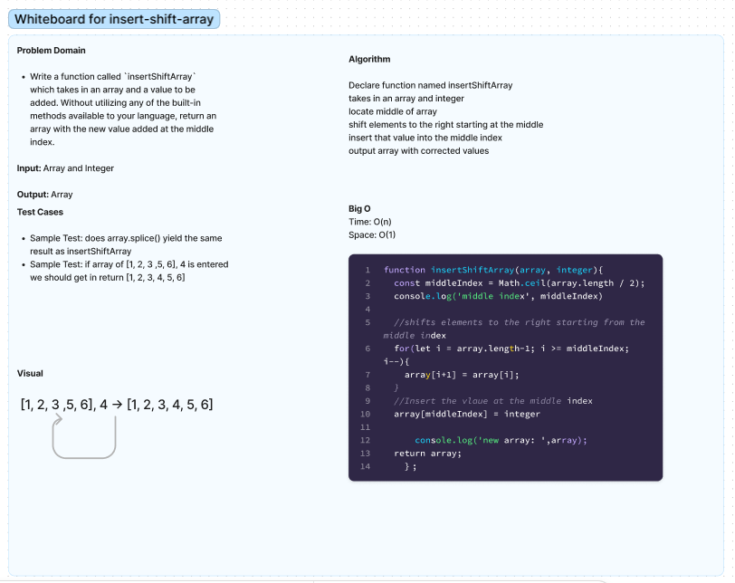
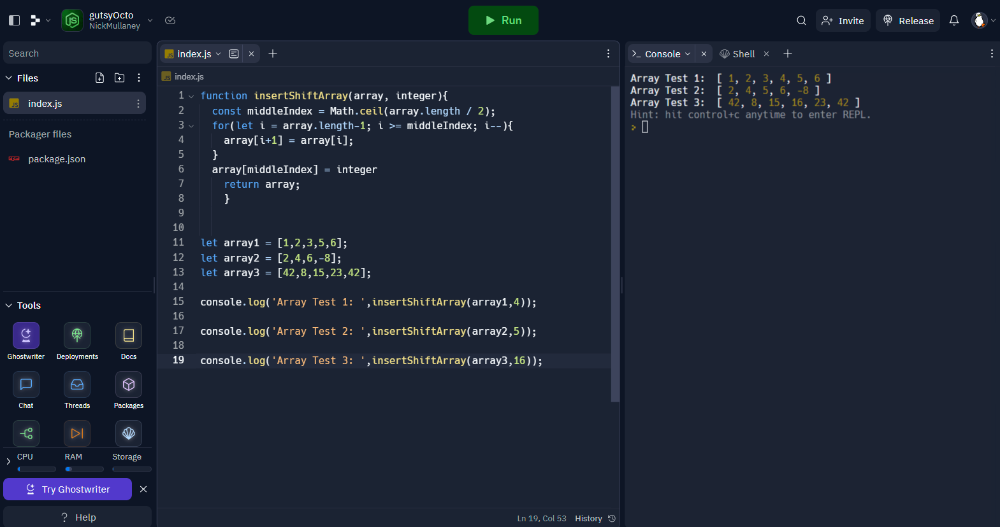

# Array-insert-shift
Write a function called `insertShiftArray` which takes in an array and a value to be added. Without utilizing any of the built-in methods available in Javascript return an array with the new value added at the middle index
## Whiteboard Process

## Approach & Efficiency
We took the approach of finding the middle location and shifting all items in the array to the right and then replacing the middle index with the new value
<!-- What approach did you take? Why? What is the Big O space/time for this approach? -->
I was partnered with Ryan Eastman for this assignment. We discussed the problem and came up with a solution together. We decided to create a for loop to iterate through our array and use math.ceil() and array.length to locate the middle index. As the loop does this, it shifts elements within our array to the right starting from the middle index. The integer value is then plugged into the middle index and the returned array yeilds the desired outcome.
The Big O space/time for this approach is O(n) because we are iterating through the array once. The splice method is also O(n) because it is iterating through the array to insert the value at the middle index. This means that the overall Big O space/time is O(n) + O(n) = O(2n) = O(n).
## Solution
<!-- Show how to run your code, and examples of it in action -->

## Collaboration

Thanks to Ryan Eastman for working on this with me