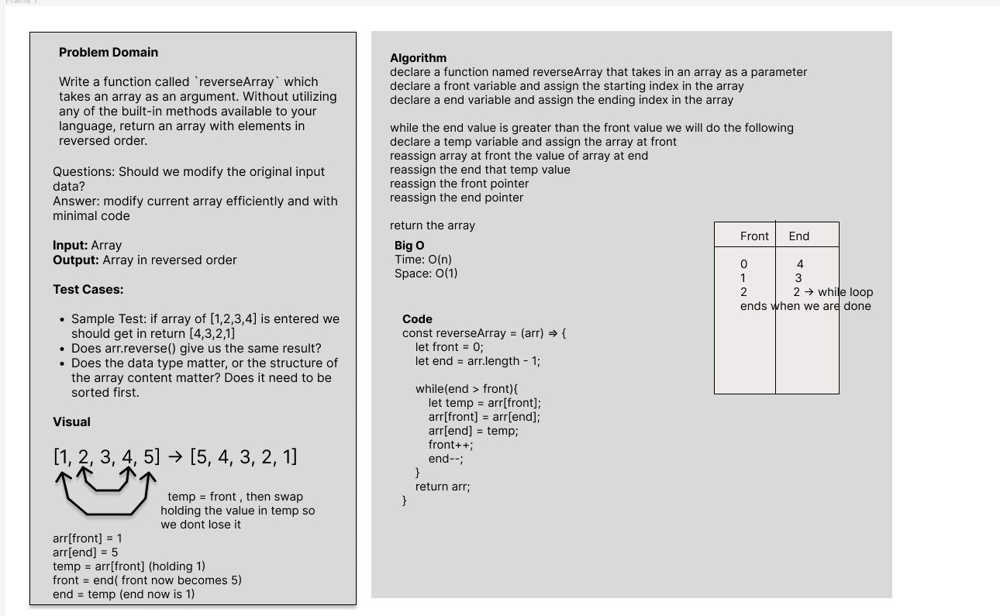

# array-reverse
Write a function called `reverseArray` which takes an array as an argument. Without utilizing any of the built-in methods available to your language, return an array with elements in reversed order.

## Whiteboard Process


## Approach & Efficiency

For this particular challenge I took the approach of not creating another array to hold the new values. The current array is the only thing being modified because that keeps the code simple and clean for this one object
<!-- What approach did you take? Why? What is the Big O space/time for this approach? -->

## Solution
```
const reverseArray = (arr) => {

	let front = 0;

	let end = arr.length - 1;

	while(end > front){

		let temp = arr[front];

		arr[front] = arr[end];

		arr[end] = temp;

		front++;

		end--;

	}

	return arr;

}

```

#### Code in action


<!-- Show how to run your code, and examples of it in action -->


### Collaboration	

-Thank you to Ryan Gallaway for the code sample to draw from for this assignment