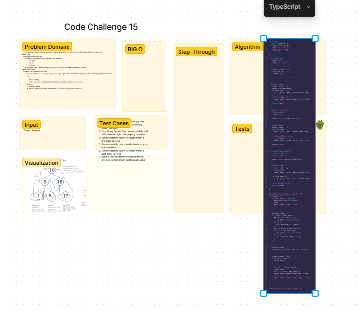

## Description

The Binary Search Tree is a class that implements a binary search tree data structure. It provides methods to add nodes, check if a value is contained in the tree, perform depth-first traversals, and find the maximum value in the tree.

The Binary Search Tree follows the binary search tree property, where the left child of a node is always less than its value, and the right child is always greater. This property allows for efficient searching, insertion, and retrieval of values in logarithmic time.

## Node

The `Node` class represents a node in the binary search tree. It has properties for the value stored in the node and pointers to the left and right child nodes.

## BinaryTree

The `BinaryTree` class represents a binary tree and provides methods for depth-first traversals, including pre-order, in-order, and post-order traversals. It serves as the base class for the `BinarySearchTree` class.

### Methods

- `add(value)`: Adds a new node with the given value to the binary search tree in the correct location based on the binary search tree property.
- `contains(value)`: Returns a boolean indicating whether the given value is contained in the binary search tree.
- `findMaximumValue()`: Returns the maximum value in the binary search tree.

The `add(value)` method adds a new node to the binary search tree by following the binary search tree property. It compares the value with each node and determines whether it should be placed as the left or right child of the current node until it finds the correct position.

The `contains(value)` method performs a search in the binary search tree to check if the given value is present. It compares the value with each node in the tree, recursively traversing to the left or right child until the value is found or the end of the tree is reached.

The `findMaximumValue()` method traverses the binary search tree and returns the maximum value found. It starts from the root node and recursively explores the right child of each node until it reaches the leaf node with the highest value.

```javascript
const tree = new BinarySearchTree();
tree.add(5);
tree.add(3);
tree.add(7);

console.log(tree.contains(3)); // Output: true
console.log(tree.contains(10)); // Output: false

console.log(tree.findMaximumValue()); // Output: 7
```

Please note that the `findMaximumValue()` method is now included in the Methods section, along with its description and usage example.

## Whiteboard Process
  Code Challenge 11


## Approach & Efficiency

The `BinarySearchTree` class is implemented using a binary search tree data structure. When adding a new node, it is placed in the correct location based on the binary search tree property, which ensures that the left child of a node is less than its value, and the right child is greater than its value.

The `contains` method performs a search in the binary search tree by comparing the value with the current node. It recursively traverses the tree, moving to the left child if the value is less than the current node's value, or to the right child if it is greater. If the value is found, it returns true; otherwise, it returns false.

The time complexity of adding a node to the binary search tree is O(log N) in the average case, where N is the number of nodes in the tree. In the worst case, when the tree is skewed, the time complexity becomes O(N). The space complexity is O(log N) in the average case for the recursive calls, and O(N) in the worst case for a skewed tree.

The time complexity of the `contains` method is also O(log N) in the average case, and O(N) in the worst case. The space complexity is O(log N) for the recursive calls.

## Testing

To test the functionality of the `BinarySearchTree` class, the following tests can be performed:

### Test 1: Instantiate an empty tree

```javascript
const tree = new BinarySearchTree();
expect(tree.root).toBe(null);
```

### Test 2: Instantiate a tree with a single root node

```javascript
const tree = new BinarySearchTree();
tree.add(5);
expect(tree.root.value).toBe(5);
```

### Test 3: Add left and right child nodes properly

```javascript
const tree = new BinarySearchTree();
tree.add(5);
tree.add(3);
tree.add(7);
expect(tree.root.left.value).toBe(3);
expect(tree.root.right.value).toBe(7);
```

### Test 4: Return a collection from a pre-order traversal

```javascript
const tree = new BinarySearchTree();
tree.add(5);
tree.add(3);
tree.add(7);
expect(tree.preOrder()).toEqual([5, 3, 7]);
```

### Test 5: Return a collection from an in-order traversal

```javascript
const tree = new BinarySearchTree();
tree.add(5);
tree.add(3);
tree.add(7);
expect(tree.inOrder()).toEqual([3, 5

, 7]);
```

### Test 6: Return a collection from a post-order traversal

```javascript
const tree = new BinarySearchTree();
tree.add(5);
tree.add(3);
tree.add(7);
expect(tree.postOrder()).toEqual([3, 7, 5]);
```

### Test 7: Return true/false for the contains method

```javascript
const tree = new BinarySearchTree();
tree.add(5);
tree.add(3);
tree.add(7);
expect(tree.contains(3)).toBe(true);
expect(tree.contains(10)).toBe(false);
```

### Test 8: Find the maximum value in the tree
```
const tree = new BinarySearchTree();
tree.add(5);
tree.add(3);
tree.add(7);
expect(tree.findMaximumValue()).toBe(7);
```

## Collaboration

Thanks to chatgpt for helping with the testing 