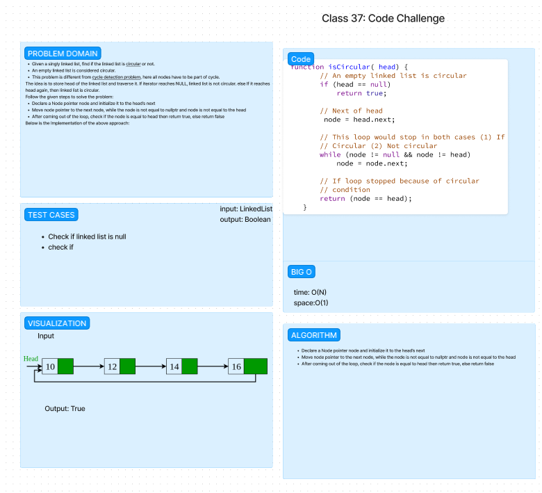

# Circular Linked List

## Author

Nick Mullaney

The circular linked list problem involves determining whether a given singly linked list is circular or not. A circular linked list has a cycle where the last node points back to one of the previous nodes in the list.

### UML



### Problem Description

Given a singly linked list, write a function to determine if the linked list is circular or not.

### Approach

To determine if a linked list is circular, we can use Floyd's Cycle-Finding Algorithm, also known as the "Tortoise and the Hare" algorithm. This algorithm uses two pointers, one moving at a slower pace (tortoise) and the other moving at a faster pace (hare). If there is a cycle in the linked list, eventually the hare will catch up to the tortoise.

We start with both pointers at the head of the linked list. The tortoise moves one step at a time, while the hare moves two steps at a time. If the hare reaches the end of the list (i.e., encounters a null next pointer), it means there is no cycle and the linked list is not circular. If, during the traversal, the tortoise and hare pointers meet at the same node, it indicates the presence of a cycle, and the linked list is circular.

### JavaScript Implementation

The following is an example implementation in JavaScript:

```javascript
function isLinkedListCircular(head) {
  if (head === null || head.next === null) {
    return false; // An empty list or a list with only one node is not circular
  }

  let tortoise = head;
  let hare = head.next;

  while (hare !== null && hare.next !== null) {
    if (tortoise === hare) {
      return true; // The tortoise and the hare meet, so the list is circular
    }
    tortoise = tortoise.next;
    hare = hare.next.next;
  }

  return false; // The hare reached the end of the list, so it's not circular
}
```

### Time Complexity

The time complexity of this algorithm is O(n), where n is the number of nodes in the linked list. In the worst case, the algorithm traverses the entire list once.

### Space Complexity

The space complexity of this algorithm is O(1) since it uses a constant amount of additional space to store the tortoise and hare pointers.

## Testing

To test the functionality of the `Circular Linked List` function, you can run `npm test circular.test.js` in the root directory of the repository. The test file is located at `javascript/circularLinkedList/circular.test.js`.

## License

This project is licensed under the [MIT License](LICENSE).

## Collaboration

Thanks to ChatGPT for assisting in testing and documentation.

