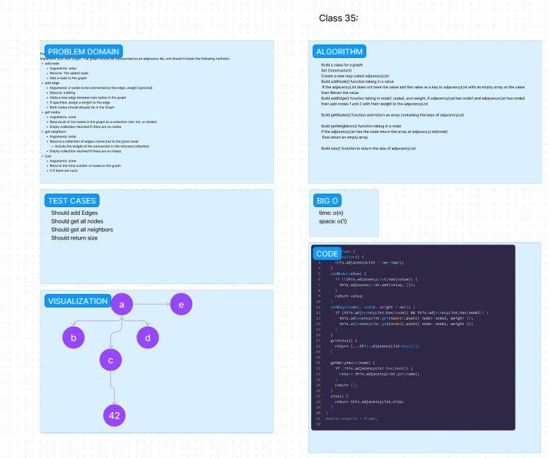

Certainly! Here's a new README.md file for the graph function and tests, following the structure and formatting of the example you provided:

# Graph

## Author:

Nick Mullaney

The `Graph` class represents a graph data structure implemented using an adjacency list. It allows adding nodes, adding edges between nodes, retrieving nodes and their neighbors, and determining the size of the graph.

### UML

### `Graph` Class

The `Graph` class provides the following methods:

#### `addNode(value)`

Description: Adds a new node to the graph.

Parameters:
- `value`: The value of the node to be added.

Return Value:
- The added node.

#### `addEdge(node1, node2, weight)`

Description: Adds a new edge between two nodes in the graph.

Parameters:
- `node1`: The first node to be connected by the edge.
- `node2`: The second node to be connected by the edge.
- `weight` (optional): The weight of the edge.

Return Value: None.

#### `getNodes()`

Description: Returns all of the nodes in the graph.

Parameters: None.

Return Value:
- A collection (set, list, or similar) containing all the nodes in the graph.
- An empty collection is returned if there are no nodes.

#### `getNeighbors(node)`

Description: Returns a collection of edges connected to the given node.

Parameters:
- `node`: The node for which to retrieve the neighbors.

Return Value:
- A collection of edges connected to the given node.
- Each edge object should include the connected node and the weight of the connection.
- An empty collection is returned if there are no neighbors.

#### `size()`

Description: Returns the total number of nodes in the graph.

Parameters: None.

Return Value:
- The total number of nodes in the graph.
- 0 is returned if there are no nodes.

## Approach

The `Graph` class uses an adjacency list to represent the graph. Each node is stored as a key in a JavaScript object, and the corresponding value is an array of edges connected to that node. Each edge in the array includes the connected node and the weight (if applicable).

The methods of the `Graph` class manipulate the adjacency list to perform various graph operations. Adding a node simply involves adding a new key-value pair to the object. Adding an edge requires updating the arrays of both nodes involved. Retrieving nodes and neighbors is straightforward by accessing the corresponding values in the object. Determining the size of the graph is a matter of counting the keys in the object.

## Time Complexity

The time complexity of the `Graph` class methods depends on the specific operation:

- Adding a node or an edge has a time complexity of O(1).
- Retrieving nodes and neighbors has a time complexity of O(1) on average, as it involves accessing values in the adjacency list.
- Determining the size of the graph has a time complexity of O(1), as it requires counting the keys in the adjacency list.

## Space Complexity

The space complexity of the `Graph` class depends on the number of nodes and edges in the graph:

- The space complexity for storing nodes is O(n), where n is the number of nodes in the graph.
- The space complexity for storing edges is O(m), where m is the number of edges in the graph.
- Overall, the space complexity is O(n + m).

## Testing

To test the functionality of the `Graph` class, you can run `npm test graph` in the root directory of the repository. The test file is located at `javascript/graph/graph.test.js`.

## License

This project is licensed under the [MIT License](LICENSE).

## Collaboration

Thanks to ChatGPT for assisting in testing and documentation.

