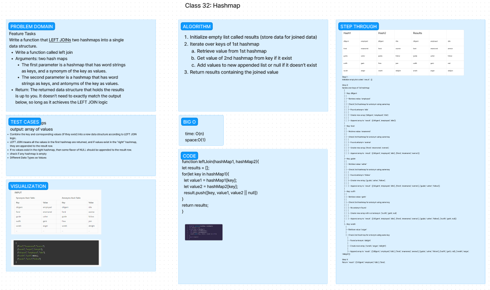

# Left Join

## Author:

Nick Mullaney

The `leftJoin` function joins two hashmaps into a single data structure based on the LEFT JOIN logic. It combines the key-value pairs from the first hashmap with corresponding values (if available) from the second hashmap. If no corresponding value exists in the second hashmap, it appends a null value.

### UML



### `leftJoin(hashmap1, hashmap2)`

Description: Joins two hashmaps into a single data structure using the LEFT JOIN logic.

Parameters:
- `hashmap1`: The first hashmap containing word strings as keys and synonyms as values.
- `hashmap2`: The second hashmap containing word strings as keys and antonyms as values.

Return Value:
- Returns a new data structure containing the joined key-value pairs according to the LEFT JOIN logic.

## Approach

The `leftJoin` function initializes an empty result data structure to hold the joined values. It then iterates through the keys in the first hashmap. For each key, it retrieves the corresponding value from the first hashmap and checks if a corresponding value exists in the second hashmap. It creates a new entry in the result data structure with the key from the first hashmap and the values from both hashmaps (or null if no corresponding value exists in the second hashmap). Finally, it repeats this process for all keys in the first hashmap and returns the result data structure.

## Time Complexity

The time complexity of the `leftJoin` function is O(n), where n is the number of keys in the first hashmap. It iterates through the keys once to retrieve the corresponding values from both hashmaps.

## Space Complexity

The space complexity of the `leftJoin` function is O(n), where n is the number of keys in the first hashmap. It creates a new data structure to store the joined key-value pairs, which can grow up to the number of keys in the first hashmap.

## Testing

To test the functionality of the `leftJoin` function, you can write tests similar to the following:

```javascript
const leftJoin = require('./leftJoin');

const hashmap1 = {'happy': 'joyful', 'sad': 'unhappy', 'good': 'great'};
const hashmap2 = {'happy': 'sad', 'good': 'bad', 'small': 'big'};

console.log(leftJoin(hashmap1, hashmap2));
// Expected output: [['happy', 'joyful', 'sad'], ['sad', 'unhappy', null], ['good', 'great', 'bad']]
```

Make sure to include various test cases to cover different scenarios, such as when both hashmaps have matching keys, when a key in the first hashmap has no corresponding value in the second hashmap, and when the second hashmap is empty.

## License

This project is licensed under the [MIT License](LICENSE).

## Collaboration

Thanks to Coriana for helping me out with the code challenge

Thanks to ChatGPT for assisting in the testing.